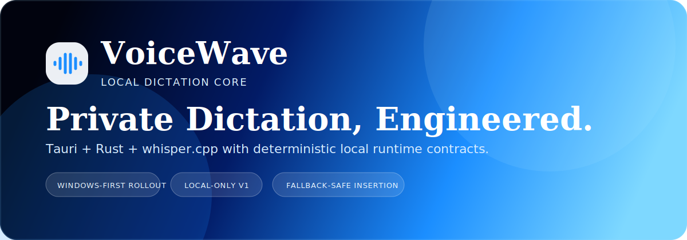
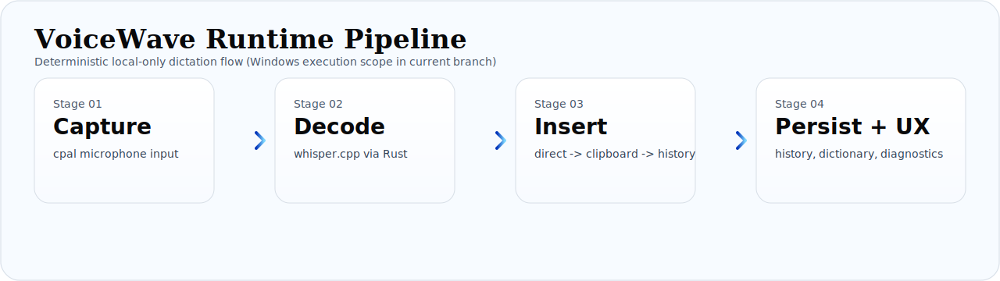

# VoiceWave



VoiceWave is a privacy-first desktop dictation system built for low-latency local transcription and reliable text insertion.

Current v1 runtime path is local-only (`whisper.cpp` through Rust) with a Windows-first execution scope in this branch.

## Product At A Glance

| Area | Summary |
| --- | --- |
| Runtime | `Tauri 2` shell + `Rust` core + `React/Tailwind` frontend |
| ASR | `whisper.cpp` runtime via `whisper-rs` (local models, no cloud audio path) |
| UX Contract | Explicit state model: `idle -> listening -> transcribing -> inserted/error` |
| Insertion Reliability | Direct insert -> clipboard fallback -> history fallback |
| Platform Scope | Windows implementation/validation active since `2026-02-10` |

## Core Capabilities

| Icon | Capability | Technical Detail |
| --- | --- | --- |
|  | Local-Only Privacy | Production path has no outbound audio transport and no cloud transcription rewrite path for v1. |
|  | Deterministic Runtime Flow | Audio capture, inference orchestration, insertion, and persistence are handled in Rust services behind Tauri commands/events. |
|  | Fallback-Safe Insertion | Insertion engine prioritizes direct insertion and degrades to clipboard/history fallback to preserve user text. |
|  | Verified Model Lifecycle | Model install/switch includes cataloging, checksum verification, and recommendation logic. |

## Runtime Architecture



Primary architecture boundary is defined in [docs/rfc/0001-system-architecture.md](docs/rfc/0001-system-architecture.md).

Core modules:

1. `desktop-shell` (Tauri host)
1. `audio-pipeline` (capture, resample, buffering, VAD)
1. `inference-worker` (whisper.cpp integration + cancellable jobs)
1. `insertion-engine` (direct/clipboard/history reliability chain)
1. `hotkey-manager` (global binding lifecycle)
1. `model-manager` (catalog/download/checksum/health)
1. `persistence` (local settings/history/stats)
1. `diagnostics` (redacted export, opt-in)
1. `experience-state` (shared state contract for UX)

## Status Snapshot (Repository Baseline)

As documented in this branch:

1. Phase 0 complete.
1. Phase 1 complete for Windows runtime integration.
1. Phase 2 implemented and validated in Windows execution scope.
1. Phase 3 implemented and validated for Windows rescue baseline.
1. Phase 4 readiness gate complete (`npm run phase4:gate` passes).
1. Phase 5 readiness pack prepared; implementation not started.
1. Phase 6 not started.

Open release blockers called out in current docs:

1. Full manual acceptance checklist rows remain incomplete for Notepad, VS Code, and browser dictation workflow on target hardware.
1. `>= 30` minute sustained battery evidence is deferred by marker and still required before GA.

References:

1. [docs/PHASE3_IMPLEMENTATION.md](docs/PHASE3_IMPLEMENTATION.md)
1. [docs/PHASE4_READINESS.md](docs/PHASE4_READINESS.md)
1. [docs/PHASE5_READINESS.md](docs/PHASE5_READINESS.md)
1. [docs/phase3/artifacts/windows-manual-acceptance-2026-02-11.md](docs/phase3/artifacts/windows-manual-acceptance-2026-02-11.md)

## Stack

1. Frontend: `React 18` + `Tailwind` + `Vite`
1. Desktop shell: `Tauri 2`
1. Core runtime: `Rust`
1. ASR runtime target: `whisper.cpp` via `whisper-rs`
1. Local storage/ops: encrypted billing files + local runtime state/history artifacts

## Quick Start

1. Install dependencies:

```powershell
npm install
```

1. Run frontend dev mode:

```powershell
npm run dev
```

1. Run tests:

```powershell
npm run test -- --run
```

1. Build frontend:

```powershell
npm run build
```

1. Run desktop app (requires Rust/Tauri prerequisites):

```powershell
npm run tauri:dev
```

1. In app: open `Models`, install `tiny.en` or `base.en`, then run dictation from `Home`.

## Validation and Gates

| Command | Purpose |
| --- | --- |
| `npm run phase1:validate` | Phase I validation suite |
| `npm run phase1:battery` | Phase I battery/thermal run |
| `npm run phase2:validate` | Phase II validation suite |
| `npm run phase3:validate` | Phase III validation suite |
| `npm run phase4:prep` | Phase IV readiness report |
| `npm run phase4:gate` | Phase IV blocking gate |
| `npm run phase5:prep` | Phase V readiness report |
| `npm run phase5:gate` | Phase V blocking readiness gate |
| `npm run phase5:reliability` | Phase V reliability evidence report |
| `npm run phase5:reliability:gate` | Phase V blocking reliability gate |
| `npm run phaseA:cpu` | CPU latency sweep |
| `npm run phaseB:gpu:check` | GPU readiness check |
| `npm run phaseB:gpu` | GPU latency sweep |
| `npm run phaseB:fw` | Faster-whisper latency sweep |

## Runtime Contract Surface (High-Level)

Phase I baseline commands:

1. `start_dictation(mode)`
1. `cancel_dictation()`
1. `load_settings()`
1. `update_settings(settings)`
1. `get_voicewave_snapshot()`

Phase II additions include hotkey, permission, and insertion command surfaces.

Phase III additions include model manager, benchmark/recommendation, history, and dictionary command surfaces.

Phase V additions include diagnostics status and export command surfaces.

See full contract list in [docs/rfc/0001-system-architecture.md](docs/rfc/0001-system-architecture.md).

## Monetization and Entitlements

Windows baseline monetization is implemented with local encrypted entitlement storage.

Pricing baseline:

1. Base: `~$4/mo~`
1. Launch offer: `$1.50/mo` for first 3 months, then `$4/mo`

Entitlement statuses:

1. `free`
1. `pro_active`
1. `grace`
1. `expired`
1. `owner_override`

Pro-gated features include advanced formatting profiles, domain packs, code mode, app-aware profiles, and advanced history controls.

Reference: [docs/monetization.md](docs/monetization.md)

## Privacy and Security Guardrails

1. No outbound audio transport in production path.
1. Local-only ASR and deterministic local post-processing in current monetization architecture.
1. Model/update verification paths are documented in phase evidence.
1. Diagnostics export is user-triggered and revocable.

References:

1. [docs/security/threat-model-v1.md](docs/security/threat-model-v1.md)
1. [docs/risk/risk-register.md](docs/risk/risk-register.md)
1. [docs/phase4/evidence/update-signing-verification.md](docs/phase4/evidence/update-signing-verification.md)

## Latest Recorded Validation Evidence

Latest summary currently documented in this branch: `2026-02-17`.

1. `npm run test -- --run` recorded pass (`3` test files / `12` tests).
1. `npm run build` recorded pass.
1. `npm run phase3:validate` recorded pass.
1. `npm run phase4:gate` recorded pass.

Reference artifact trail:

1. [docs/phase3/artifacts](docs/phase3/artifacts)
1. [docs/phase4/artifacts](docs/phase4/artifacts)
1. [docs/phase5/artifacts](docs/phase5/artifacts)
1. [docs/testing/hardware-tier-recommendation-windows.json](docs/testing/hardware-tier-recommendation-windows.json)

## CI

Workflow: [.github/workflows/ci.yml](.github/workflows/ci.yml)

Current CI baseline includes:

1. Docs formatting checks
1. Markdown lint
1. Secrets scan
1. Phase 0 artifact integrity checks
1. Frontend tests and build
1. Rust tests and compile paths

## Repository Map

```text
src/                   # React app and UI runtime bridge
src-tauri/             # Rust core runtime + Tauri shell
voicewave-website/     # Marketing website
docs/                  # RFCs, phase plans, evidence, security, testing
scripts/               # Validation, readiness, benchmark, tauri utilities
vendor/                # Local whisper-rs / whisper.cpp vendored deps
```

## Source of Truth Docs

1. Product requirements: [docs/prd/v1-prd.md](docs/prd/v1-prd.md)
1. Architecture RFC: [docs/rfc/0001-system-architecture.md](docs/rfc/0001-system-architecture.md)
1. Test strategy: [docs/testing/test-strategy.md](docs/testing/test-strategy.md)
1. Hardware tiers: [docs/testing/hardware-tiers.md](docs/testing/hardware-tiers.md)
1. Phase recovery plan: [docs/PHASE_RECOVERY_PLAN.md](docs/PHASE_RECOVERY_PLAN.md)
1. Implementation ledger: [Idea.md](Idea.md)
1. Phase I implementation: [docs/PHASE1_IMPLEMENTATION.md](docs/PHASE1_IMPLEMENTATION.md)
1. Phase II implementation: [docs/PHASE2_IMPLEMENTATION.md](docs/PHASE2_IMPLEMENTATION.md)
1. Phase III implementation: [docs/PHASE3_IMPLEMENTATION.md](docs/PHASE3_IMPLEMENTATION.md)
1. Phase III remaining: [docs/PHASE3_REMAINING.md](docs/PHASE3_REMAINING.md)
1. Phase IV readiness: [docs/PHASE4_READINESS.md](docs/PHASE4_READINESS.md)
1. Phase V readiness: [docs/PHASE5_READINESS.md](docs/PHASE5_READINESS.md)

## Local Verification Utility

```powershell
# Phase 0 artifact checks
& "C:\Windows\System32\WindowsPowerShell\v1.0\powershell.exe" -ExecutionPolicy Bypass -File .\scripts\ci\check-phase0-artifacts.ps1
```
