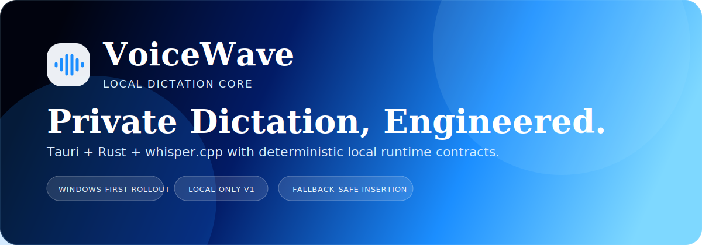
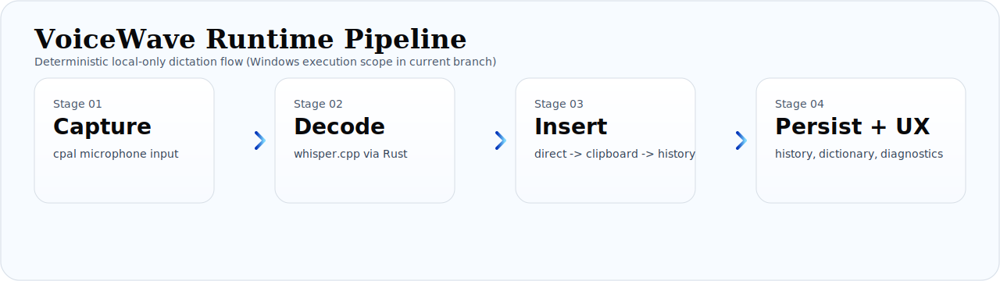

# VoiceWave



> 🎙️ **Offline, privacy-first dictation for Windows** · no cloud · no subscription trap · Whisper accuracy · < 500 ms cold start

```powershell
winget install VoiceWave.LocalCore
```

[](https://github.com/rithwik1510/VoiceWave-Open-Source-WhisperFlow-Alternative/stargazers)
[](https://github.com/rithwik1510/VoiceWave-Open-Source-WhisperFlow-Alternative/releases)
[](https://github.com/rithwik1510/VoiceWave-Open-Source-WhisperFlow-Alternative/releases/latest)
[](LICENSE)
[](https://github.com/rithwik1510/VoiceWave-Open-Source-WhisperFlow-Alternative/releases/latest)
[](https://winstall.app/apps/VoiceWave.LocalCore)

---

##  Live Demo

<p align="center">
  <video src="https://raw.githubusercontent.com/rithwik1510/VoiceWave-Open-Source-WhisperFlow-Alternative/main/timeline-demo.mp4" controls width="920">
    <a href="https://raw.githubusercontent.com/rithwik1510/VoiceWave-Open-Source-WhisperFlow-Alternative/main/timeline-demo.mp4">▶ Watch VoiceWave Live Demo</a>
  </video>
</p>

<p align="center">
  <em>VoiceWave in action: pill activation, live capture, and instant text insertion — all on-device.</em>
</p>

---

## Install

Via [Microsoft winget](https://learn.microsoft.com/windows/package-manager/) (one line, recommended):

```powershell
winget install VoiceWave.LocalCore
```

`winget upgrade VoiceWave.LocalCore` keeps you current on every future release.

Or grab the [v0.3.1 installer directly](https://github.com/rithwik1510/VoiceWave-Open-Source-WhisperFlow-Alternative/releases/download/v0.3.1/VoiceWave.Local.Core_0.3.1_x64-setup.exe) and run it.

---

## Why VoiceWave?

| | **VoiceWave** | Wispr Flow Pro | Dragon Professional | Windows Speech |
|---|:---:|:---:|:---:|:---:|
| **Price** | **Free** | $15/mo | ~$500 one-time | Free |
| **Works Offline** | ✅ Always | ❌ Cloud-only | ✅ Yes | ✅ Yes |
| **Audio stays on device** | ✅ Never leaves | ❌ Sent to servers | ✅ Local | ✅ Local |
| **Accuracy engine** | Whisper (local) | Whisper (cloud) | Proprietary | Proprietary |
| **Open Source** | ✅ | ❌ | ❌ | ❌ |
| **Windows** | ✅ | ✅ | ✅ | ✅ |
| **Free tier** | ✅ (open source) | 2,000 words/week | ❌ | ✅ (limited) |
| **Latency** | < 500 ms | Network-dependent | < 1 s | Varies |
| **Customizable** | ✅ Rust/React | ❌ | ❌ | ❌ |

Wispr Flow Pro pricing source: [wisprflow.ai/pricing](https://wisprflow.ai/pricing) (April 2026 — $15/mo, $12/mo billed annually).

---

## What's New in 0.3.1

**Audio pipeline**

1. Soft word endings ("s", "th", "f", drifted "e") no longer clipped — post-release capture window lifted to 300 ms, with a matching 300 ms trim pad on both capture and inference layers.
1. Volume-adaptive trim thresholds — quiet speakers and post-pause resumptions now land fully instead of being truncated as silence.
1. All aggressive DSP (pre-emphasis, gain normalization, noise attenuation, hum notch, soft limiter) defaults to off. Whisper receives audio as captured.

**Inference**

1. Cold-start prewarm at app launch — first dictation drops from 2–5 s to ~500 ms.
1. Extra hallucination guard: `log_prob_threshold = -1.0` on the primary decode alongside the existing `no_speech` and `compression_ratio` floors.
1. Opt-in `whisper.cpp` models: `wcpp-small.en` (~466 MB) and `wcpp-large-v3-turbo` (~1.6 GB). `Vulkan` backend available behind the `whisper-vulkan` cargo feature.

**Reliability**

1. Push-to-talk release no longer drops silently on key bounce.
1. Clipboard paste keeps the dictated text — no more "old content pasted" after delayed Ctrl+V.
1. SendInput refuses to type into Windows security dialogs (UAC, Credential Manager, PIN prompts).
1. Worker stdout drained between requests to prevent ID-mismatch stalls after cancel/retry.
1. Decode threads reserve one CPU core for the UI to stop taskbar stutter during transcription.

---

##  Product At A Glance

| Area | Summary |
| --- | --- |
| Runtime | `Tauri 2` shell + `Rust` core + `React/Tailwind` frontend |
| ASR (default) | `faster-whisper` via Python subprocess (`fw-small.en` / `fw-large-v3`), CUDA auto-detected |
| ASR (opt-in) | `whisper.cpp` via `whisper-rs` (`wcpp-small.en` / `wcpp-large-v3-turbo`), Vulkan feature flag |
| Privacy Path | No outbound audio transport, no cloud transcription path in v1 |
| UX Contract | Explicit state model: `idle -> listening -> transcribing -> inserted/error` |
| Insertion Reliability | Direct insert -> clipboard fallback -> history fallback (blocked on Windows security dialogs) |
| Platform Scope | Windows implementation/validation active since `2026-02-10` |

##  Core Capabilities

| Icon | Capability | Technical Detail |
| --- | --- | --- |
|  | Local-Only Privacy | Production path has no outbound audio transport and no cloud transcription rewrite path for v1. |
|  | Deterministic Runtime Flow | Audio capture, inference orchestration, insertion, and persistence are handled in Rust services behind Tauri commands/events. |
|  | Fallback-Safe Insertion | Insertion engine prioritizes direct insertion and degrades to clipboard/history fallback to preserve user text. |
|  | Verified Model Lifecycle | Model install/switch includes cataloging, checksum verification, and recommendation logic. |

##  Runtime Architecture



Primary architecture boundary is defined in [docs/rfc/0001-system-architecture.md](docs/rfc/0001-system-architecture.md).

Core modules:

1. `desktop-shell` (Tauri host)
1. `audio-pipeline` (capture, resample, buffering, VAD)
1. `inference-worker` (whisper.cpp integration + cancellable jobs)
1. `insertion-engine` (direct/clipboard/history reliability chain)
1. `hotkey-manager` (global binding lifecycle)
1. `model-manager` (catalog/download/checksum/health)
1. `persistence` (local settings/history/stats)
1. `diagnostics` (redacted export, opt-in)
1. `experience-state` (shared state contract for UX)

##  Status Snapshot (Repository Baseline)

As documented in this branch:

1. Phase 0 complete.
1. Phase 1 complete for Windows runtime integration.
1. Phase 2 implemented and validated in Windows execution scope.
1. Phase 3 implemented and validated for Windows rescue baseline.
1. Phase 4 and Phase 5 gate automation is implemented (`phase4`, `phase5`, and reliability checks).
1. Release gate automation is implemented (`npm run release:gate`).
1. Phase 6 not started.

Open release blockers called out in current docs:

1. Artifact freshness policy now requires fresh evidence (`<= 7` days) for release-candidate decisions.
1. Reliability exit thresholds are stricter (`insertion >= 98%`, `correction <= 12%`, `crash-free >= 99.5%`, `TTFSD <= 3`).
1. Legal/compliance checklist and risk register are now release-gate inputs and must stay current.

References:

1. [docs/PHASE3_IMPLEMENTATION.md](docs/PHASE3_IMPLEMENTATION.md)
1. [docs/PHASE4_READINESS.md](docs/PHASE4_READINESS.md)
1. [docs/PHASE5_READINESS.md](docs/PHASE5_READINESS.md)
1. [docs/phase3/artifacts/windows-manual-acceptance-2026-02-11.md](docs/phase3/artifacts/windows-manual-acceptance-2026-02-11.md)

##  Stack

1. Frontend: `React 18` + `Tailwind` + `Vite`
1. Desktop shell: `Tauri 2`
1. Core runtime: `Rust`
1. ASR (default): `faster-whisper` (CTranslate2) via Python subprocess; CUDA auto-detected
1. ASR (opt-in): `whisper.cpp` via `whisper-rs`; Vulkan behind `whisper-vulkan` cargo feature
1. Local storage/ops: encrypted billing files + local runtime state/history artifacts

##  Quick Start

1. Install dependencies:

```powershell
npm install
```

1. Run frontend dev mode:

```powershell
npm run dev
```

1. Optional: enable cloud auth + sentence sync (Firebase):

```powershell
Copy-Item .env.example .env
```

Then fill the `VITE_FIREBASE_*` keys in `.env` from your Firebase project settings.
When configured, VoiceWave enables:

1. Email/password sign-up + sign-in
1. Per-user cloud storage of only the latest 5 sentences
1. Per-user synced approved dictionary terms
1. Recent sentence list in Home and Dictionary views

Firestore rules template is provided at:

1. `docs/firebase/firestore.rules`

1. Run tests:

```powershell
npm run test -- --run
```

1. Build frontend:

```powershell
npm run build
```

1. Run desktop app (requires Rust/Tauri prerequisites):

```powershell
npm run tauri:dev
```

1. In app: open `Models`, install `fw-small.en` (recommended default, ~466 MB) or `fw-large-v3` for highest accuracy. Optional: `wcpp-*` whisper.cpp variants live alongside them. Then run dictation from `Home`.

##  Validation and Gates

| Command | Purpose |
| --- | --- |
| `npm run phase1:validate` | Phase I validation suite |
| `npm run phase1:battery` | Phase I battery/thermal run |
| `npm run phase2:validate` | Phase II validation suite |
| `npm run phase3:validate` | Phase III validation suite |
| `npm run phase4:prep` | Phase IV readiness report |
| `npm run phase4:gate` | Phase IV blocking gate |
| `npm run phase5:prep` | Phase V readiness report |
| `npm run phase5:gate` | Phase V blocking readiness gate |
| `npm run phase5:reliability` | Phase V reliability evidence report |
| `npm run phase5:reliability:gate` | Phase V blocking reliability gate |
| `npm run release:gate` | End-to-end release blocking gate (phase4 + phase5 + risk/compliance) |
| `npm run test:coverage` | Frontend test + coverage thresholds gate |
| `npm run security:secrets -- -Enforce` | Enforced secret leakage scan |
| `npm run security:deps -- -Enforce` | Enforced dependency vulnerability gate |
| `npm run security:firestore-rules -- -Enforce` | Firestore rules schema/policy contract gate |
| `npm run quality:frontend:gate` | Frontend quality gate (coverage + build) |
| `npm run quality:backend:gate` | Backend quality gate (tests + inventory threshold) |
| `npm run phaseA:cpu` | CPU latency sweep |
| `npm run phaseB:gpu:check` | GPU readiness check |
| `npm run phaseB:gpu` | GPU latency sweep |
| `npm run phaseB:fw` | Faster-whisper latency sweep |

##  Runtime Contract Surface (High-Level)

Phase I baseline commands:

1. `start_dictation(mode)`
1. `cancel_dictation()`
1. `load_settings()`
1. `update_settings(settings)`
1. `get_voicewave_snapshot()`

Phase II additions include hotkey, permission, and insertion command surfaces.

Phase III additions include model manager, benchmark/recommendation, history, and dictionary command surfaces.

Phase V additions include diagnostics status and export command surfaces.

See full contract list in [docs/rfc/0001-system-architecture.md](docs/rfc/0001-system-architecture.md).

##  Monetization and Entitlements

VoiceWave is free to use. Download, install, and run — no subscription required.

Reference: [docs/monetization.md](docs/monetization.md)

##  Privacy and Security Guardrails

1. No outbound audio transport in production path.
1. Local-only ASR and deterministic local post-processing in current monetization architecture.
1. Model/update verification paths are documented in phase evidence.
1. Diagnostics export is user-triggered and revocable.

References:

1. [docs/security/threat-model-v1.md](docs/security/threat-model-v1.md)
1. [docs/risk/risk-register.md](docs/risk/risk-register.md)
1. [docs/phase4/evidence/update-signing-verification.md](docs/phase4/evidence/update-signing-verification.md)

##  Latest Recorded Validation Evidence

Latest recorded run: `2026-04-23` (against `0.3.0` baseline).

1. Rust library test suite: **180 pass / 1 pre-existing failure** (`state::tests::insertion_target_classification_covers_known_app_families`, unrelated to `0.3.x` changes).
1. `npm run build` (voicewave-website): recorded pass.
1. `cargo check --no-default-features --release`: recorded pass.
1. `npm run phase3:validate`, `npm run phase4:gate`: last recorded pass from phase artifacts.

Reference artifact trail:

1. [docs/phase3/artifacts](docs/phase3/artifacts)
1. [docs/phase4/artifacts](docs/phase4/artifacts)
1. [docs/phase5/artifacts](docs/phase5/artifacts)
1. [docs/testing/hardware-tier-recommendation-windows.json](docs/testing/hardware-tier-recommendation-windows.json)

##  CI

Workflow: [.github/workflows/ci.yml](.github/workflows/ci.yml)

Current CI baseline includes:

1. Docs formatting checks
1. Markdown lint
1. Secrets scan
1. Phase 0 artifact integrity checks
1. Frontend tests and build
1. Rust tests and compile paths
1. Release gate job (`npm run release:gate`) on Windows runner

Local pre-commit guard (recommended):

1. `git config core.hooksPath .githooks`
1. `chmod +x .githooks/pre-commit` (macOS/Linux only)

##  Repository Map

```text
src/                   # React app and UI runtime bridge
src-tauri/             # Rust core runtime + Tauri shell
voicewave-website/     # Marketing website
docs/                  # RFCs, phase plans, evidence, security, testing
scripts/               # Validation, readiness, benchmark, tauri utilities
vendor/                # Local whisper-rs / whisper.cpp vendored deps
```

##  Source of Truth Docs

1. Product requirements: [docs/prd/v1-prd.md](docs/prd/v1-prd.md)
1. Architecture RFC: [docs/rfc/0001-system-architecture.md](docs/rfc/0001-system-architecture.md)
1. Test strategy: [docs/testing/test-strategy.md](docs/testing/test-strategy.md)
1. Hardware tiers: [docs/testing/hardware-tiers.md](docs/testing/hardware-tiers.md)
1. Release thresholds: [docs/testing/release-thresholds-windows.json](docs/testing/release-thresholds-windows.json)
1. Legal/compliance checklist: [docs/testing/legal-compliance-checklist.md](docs/testing/legal-compliance-checklist.md)
1. Phase recovery plan: [docs/PHASE_RECOVERY_PLAN.md](docs/PHASE_RECOVERY_PLAN.md)
1. Implementation ledger: [Idea.md](Idea.md)
1. Phase I implementation: [docs/PHASE1_IMPLEMENTATION.md](docs/PHASE1_IMPLEMENTATION.md)
1. Phase II implementation: [docs/PHASE2_IMPLEMENTATION.md](docs/PHASE2_IMPLEMENTATION.md)
1. Phase III implementation: [docs/PHASE3_IMPLEMENTATION.md](docs/PHASE3_IMPLEMENTATION.md)
1. Phase III remaining: [docs/PHASE3_REMAINING.md](docs/PHASE3_REMAINING.md)
1. Phase IV readiness: [docs/PHASE4_READINESS.md](docs/PHASE4_READINESS.md)
1. Phase V readiness: [docs/PHASE5_READINESS.md](docs/PHASE5_READINESS.md)
1. Changelog: [CHANGELOG.md](CHANGELOG.md)
1. Contributing: [CONTRIBUTING.md](CONTRIBUTING.md)

##  Local Verification Utility

```powershell
# Phase 0 artifact checks
& "C:\Windows\System32\WindowsPowerShell\v1.0\powershell.exe" -ExecutionPolicy Bypass -File .\scripts\ci\check-phase0-artifacts.ps1
```
